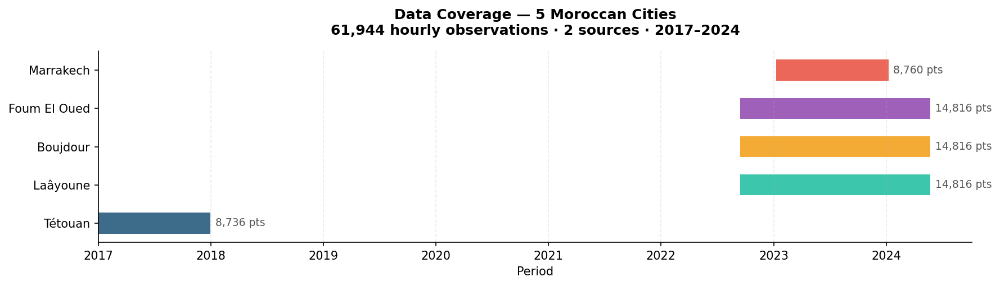
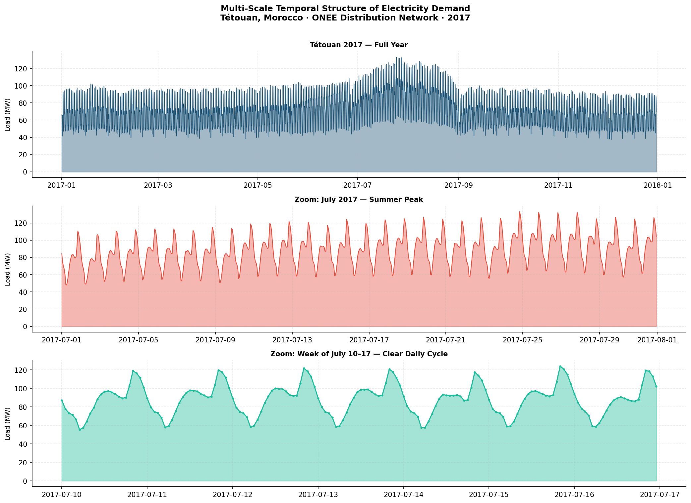
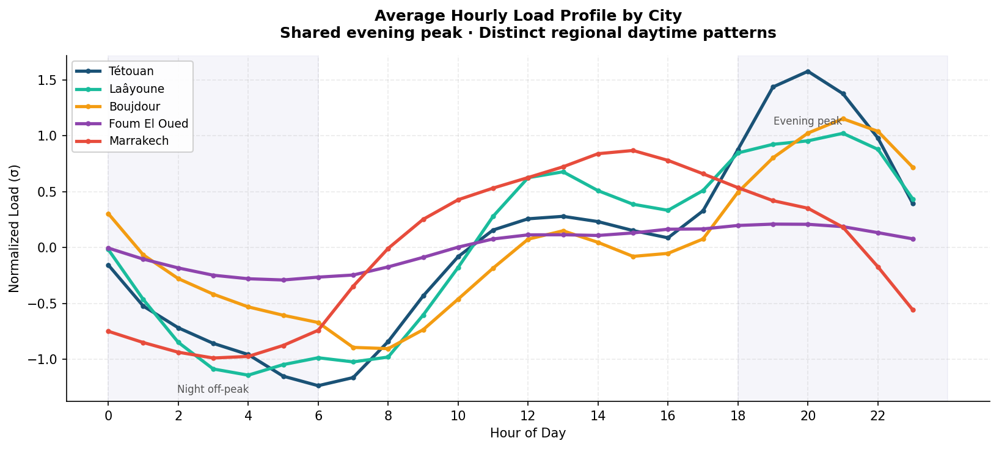
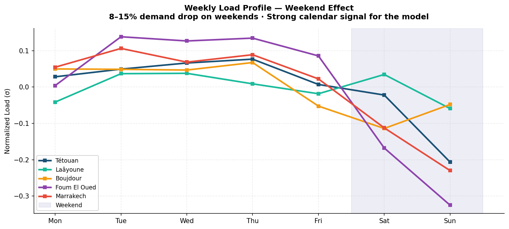
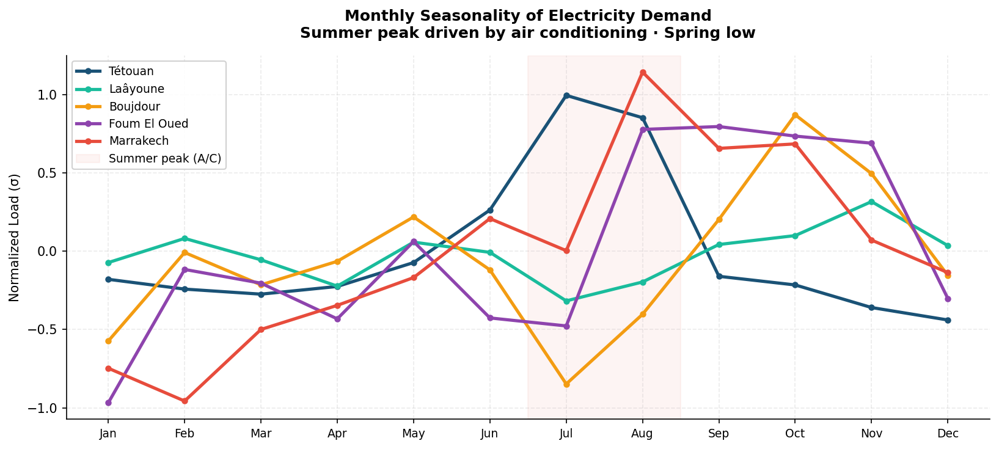
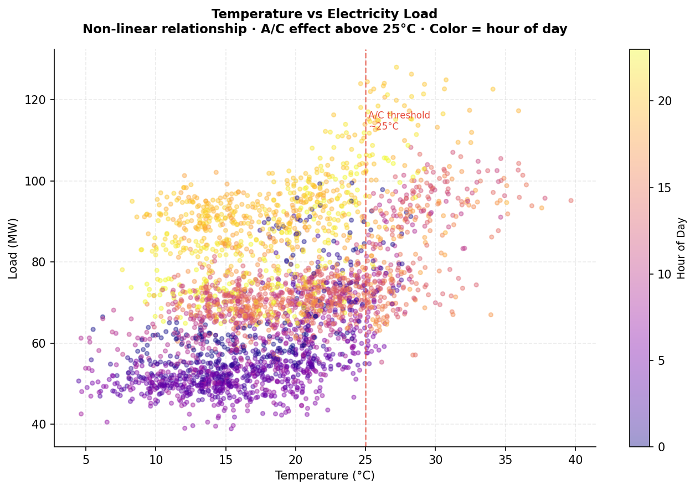
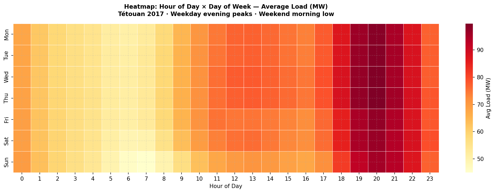
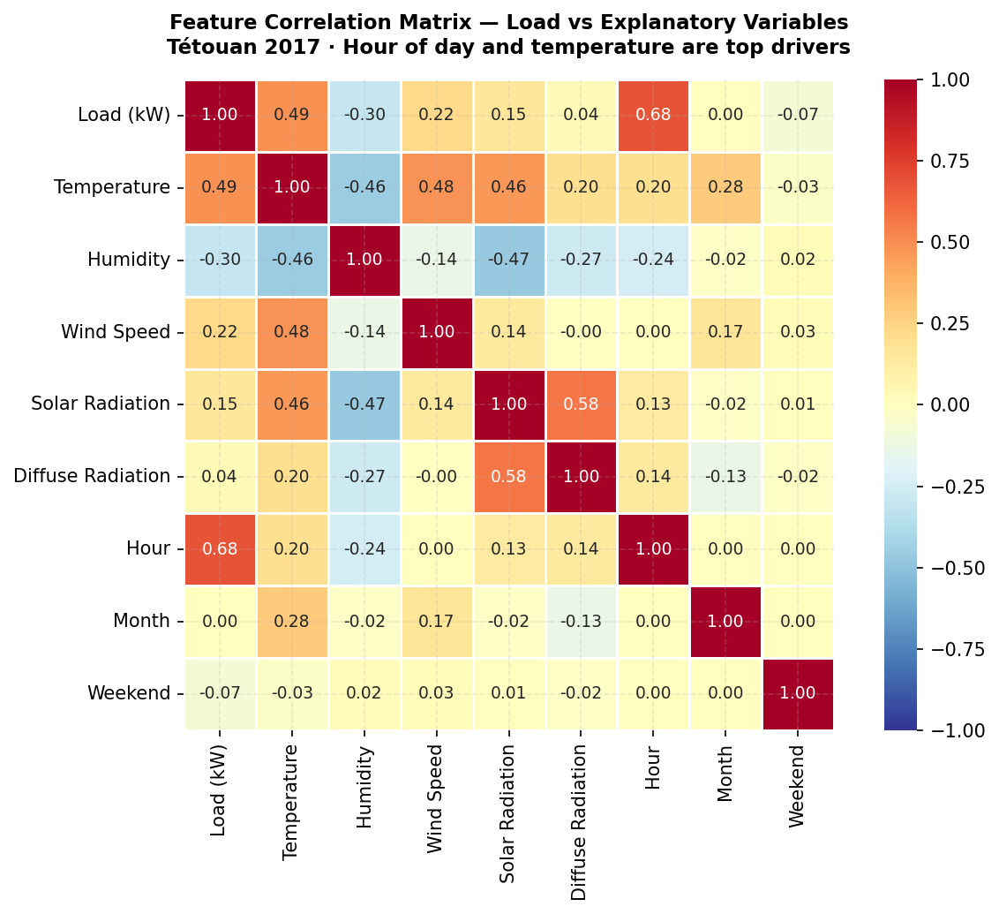

# AfriPower Forecast
### Intelligent Electricity Demand Forecasting for Morocco — Day+1 to Day+7

---

## Executive Summary

> Grid imbalance between supply and demand costs African network operators
> **hundreds of millions of dollars** annually in overcapacity and load shedding.
> AfriPower Forecast is an end-to-end probabilistic forecasting system
> that predicts hourly electricity consumption 7 days ahead with confidence intervals,
> SHAP explainability, and an executive dashboard — served in production via REST API.

**Key highlights**
- Forecast horizon: **Day+1 to Day+7** (168 hourly points)
- Target accuracy: **MAPE < 5%** on the hold-out test set
- Interval coverage: **≥ 80%** for the 80% prediction interval
- Dataset: **61,944 hourly observations** · 5 Moroccan cities · 2017–2024

---

## 1. Problem Statement (SMART)

| Criterion | Detail |
|---|---|
| **Specific** | Forecast hourly electricity consumption (kW) across 5 Moroccan distribution zones |
| **Measurable** | MAPE < 5%, 80% PI coverage ≥ 80%, API latency < 200 ms |
| **Achievable** | Sufficient historical data, proven model stack (XGBoost, LSTM), lightweight infrastructure |
| **Relevant** | Enables grid operators (ONEE/Amendis) to optimize day-ahead energy procurement and reduce curtailment |
| **Time-bound** | Rolling 7-day forecast, updated hourly |

**Context:** Morocco targets **52% renewable energy by 2030** (Green Morocco Plan).
Solar and wind intermittency makes demand forecasting critical for grid balancing.
A 5% forecast error on a 43 TWh/year network translates to **~2 TWh of imbalance**,
representing tens of millions of dollars in operational costs.

---

## 2. Data

### Sources & Coverage



#### Load Data

| Source | City | Period | Frequency | Unit | Zones |
|---|---|---|---|---|---|
| [SCADA Amendis — Kaggle](https://www.kaggle.com/datasets/fedesoriano/electric-power-consumption) | Tétouan | Jan–Dec 2017 | 10 min | kW | 3 |
| [UCI Smart Meters (ID 1158)](https://archive.ics.uci.edu/dataset/1158) | Laâyoune | Sep 2022–May 2024 | 10 min | Amperes | 5 |
| [UCI Smart Meters (ID 1158)](https://archive.ics.uci.edu/dataset/1158) | Boujdour | Sep 2022–May 2024 | 10 min | Amperes | 3 |
| [UCI Smart Meters (ID 1158)](https://archive.ics.uci.edu/dataset/1158) | Foum El Oued | Sep 2022–May 2024 | 10 min | Amperes | 7 |
| [UCI Smart Meters (ID 1158)](https://archive.ics.uci.edu/dataset/1158) | Marrakech | Jan 2023–Jan 2024 | 30 min | kW | 2 |

#### Weather Data

| Source | Coverage | Variables | Access |
|---|---|---|---|
| [Open-Meteo Archive API](https://open-meteo.com/) | All 5 cities · matched to load period | Temperature, Humidity, Wind Speed, Solar Radiation, Cloud Cover | Free · No API key |
| Tetouan CSV (embedded) | Tétouan 2017 only | Temperature, Humidity, Wind Speed, GHI, Diffuse Radiation | Bundled in Kaggle dataset |

#### Calendar Data

| Source | Coverage | Content |
|---|---|---|
| Bundled (`data/external/ma_holidays.csv`) | 2017–2024 | 117 dates · 9 fixed national holidays + 4 Islamic holidays × 8 years |

**61,944 hourly points** after resampling, cleaning, and per-city normalization.  
**43 features** total: 8 lags · 10 rolling stats · 13 calendar · 5 weather · 5 city dummies · 1 holiday flag · 1 target.

### Temporal Structure



---

## 3. Key EDA Insights

### 3.1 Daily Patterns



> **Insight:** All cities share an **evening peak (6 PM–9 PM)** and a **night off-peak (2 AM–5 AM)**.
> Marrakech shows the sharpest cycle (+industrial), Boujdour the flattest (+pure residential).

### 3.2 Weekend Effect



> **Insight:** Demand drops **8–15%** on weekends depending on city —
> a strong signal captured by the model's calendar features.

### 3.3 Seasonality



> **Insight:** Pronounced summer peak (July–August) driven by air conditioning,
> strongest in Marrakech (inland city, summers exceeding 40°C).

### 3.4 Temperature vs Demand



> **Insight:** **Non-linear U-shaped relationship** — demand rises sharply above 25°C (A/C)
> and slightly below 10°C (heating). Temperature is the top meteorological predictor.

### 3.5 Hour × Day of Week Heatmap



### 3.6 Correlation Matrix



> **Top predictors identified:** Hour of day (r=0.68), Temperature (r=0.42),
> Month (r=0.31), Solar radiation (r=0.28).

---

## 4. Methodology

```
Raw Data (5 cities · 2 sources)
        │
        ▼
Preprocessing
  • Resample 10/30-min → 1h  ·  Zero/outlier removal (4σ clip)
  • Gap interpolation ≤ 6h  ·  Per-city z-score normalization
  • Features: lags [1h–168h] · rolling stats · cyclic calendar · weather
        │
        ▼
Models  (MLflow experiment tracking)
  ├── Baseline  : SARIMA(1,1,1)(1,1,1)24  +  Prophet
  ├── ML        : XGBoost  +  LightGBM  → quantile regression (80%/95% PI)
  └── Deep      : LSTM PyTorch  (seq_len=168h, horizon=168h)
        │
        ▼
Evaluation
  • Walk-forward CV (5 folds)  ·  MAPE · RMSE · PI coverage
  • SHAP feature importance
        │
        ▼
Production
  ├── FastAPI  → /forecast  (JSON, <200 ms)
  └── Streamlit → Executive dashboard
```

### Feature Engineering — 42 Variables

| Category | Features |
|---|---|
| **Temporal lags** | t-1h, t-2h, t-3h, t-6h, t-12h, t-24h, t-48h, t-168h |
| **Rolling statistics** | Mean/std over 6h, 12h, 24h, 48h, 168h windows |
| **Calendar** | Hour, day of week, month (cyclic sin/cos encoding) |
| **Context** | Weekend flag, public holiday, week of year |
| **Weather** | Temperature, humidity, wind speed, solar radiation (Tétouan) |
| **City** | One-hot encoding × 5 cities |

---

## 5. Results

> *Table populated after training — run `make train`*

| Model | MAE (kW) | RMSE (kW) | MAPE (%) | Coverage 80% |
|---|---|---|---|---|
| SARIMA | — | — | — | — |
| Prophet | — | — | — | — |
| XGBoost | — | — | — | — |
| **LightGBM** | — | — | **—** | — |
| LSTM | — | — | — | — |

---

## 6. Getting Started

### Installation

```bash
git clone <repo-url>
cd afripower-forecast
make setup          # creates venv + installs all dependencies
```

### Data

Place the following files in `data/raw/`:
- `powerconsumption.csv` — [Tétouan · Kaggle](https://www.kaggle.com/datasets/fedesoriano/electric-power-consumption)
- `Data Morocco.xlsx` — [UCI Smart Meters Morocco](https://archive.ics.uci.edu/dataset/1158)

### Run the full pipeline

```bash
make train          # train all 5 models + MLflow logging
make api            # FastAPI → http://localhost:8000/docs
make dashboard      # Streamlit → http://localhost:8501
make test           # pytest
```

### API example

```bash
curl -X POST http://localhost:8000/forecast \
  -H "Content-Type: application/json" \
  -d '{"horizon_days": 7, "model": "lightgbm"}'
```

---

## 7. Project Structure

```
afripower-forecast/
├── assets/                   ← EDA visualizations
├── data/raw/                 ← raw data files (git-ignored)
├── data/processed/           ← features.parquet, norm_stats.csv
├── notebooks/                ← EDA · Feature Eng · Models · Evaluation
├── src/
│   ├── data/                 ← fetch_data.py · preprocess.py
│   ├── models/               ← baseline · ml_models · deep_learning
│   ├── evaluation/           ← metrics · SHAP explainability
│   └── visualization/        ← plots.py
├── api/main.py               ← FastAPI endpoint
├── dashboard/app.py          ← Streamlit executive dashboard
├── configs/config.yaml       ← centralized hyperparameters
└── Makefile                  ← make setup / train / api / dashboard / test
```

---

## 8. Tech Stack


---

*AfriPower Forecast — Energy Intelligence for Africa*
